# Diagramas de clases UML — Entrega 3 (antes y después)

Los diagramas están en **Mermaid** (se renderizan en GitHub, VS Code con extensión Mermaid, o en <https://mermaid.live> para exportar PNG/SVG e incluir la imagen en el documento integrador).

## 1. Creacionales

### Factory Method

ANTES
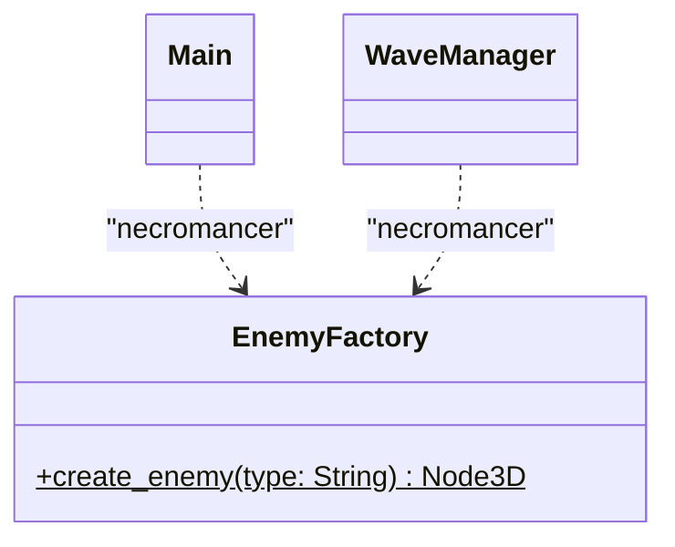
```mermaid
classDiagram
  class EnemyFactory {
    +create_enemy(type: String)$ Node3D
  }
  class Main
  class WaveManager
  Main ..> EnemyFactory : "necromancer"
  WaveManager ..> EnemyFactory : "necromancer"
```

DESPUÉS
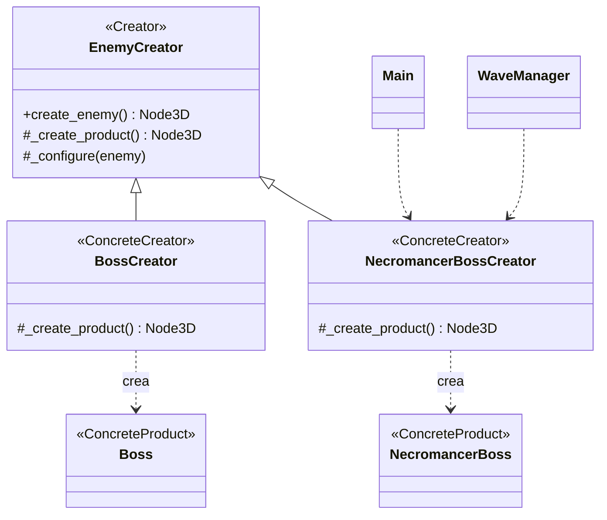
```mermaid
classDiagram
  class EnemyCreator {
    <<Creator>>
    +create_enemy() Node3D
    #_create_product() Node3D
    #_configure(enemy)
  }
  class BossCreator {
    <<ConcreteCreator>>
    #_create_product() Node3D
  }
  class NecromancerBossCreator {
    <<ConcreteCreator>>
    #_create_product() Node3D
  }
  class Boss { <<ConcreteProduct>> }
  class NecromancerBoss { <<ConcreteProduct>> }
  EnemyCreator <|-- BossCreator
  EnemyCreator <|-- NecromancerBossCreator
  BossCreator ..> Boss : crea
  NecromancerBossCreator ..> NecromancerBoss : crea
  Main ..> NecromancerBossCreator
  WaveManager ..> NecromancerBossCreator
```

### Abstract Factory (sin cambios de estructura, auditado)
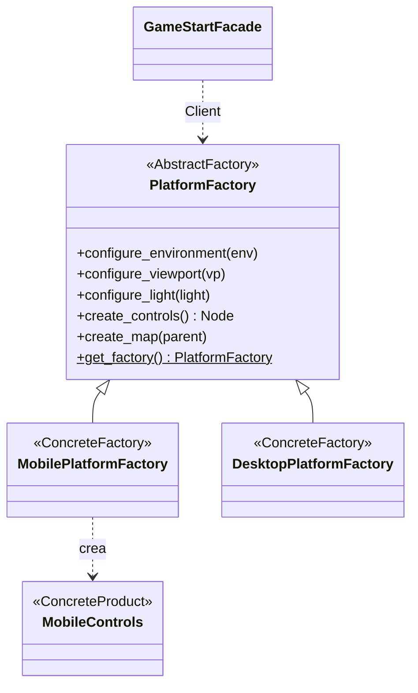
```mermaid
classDiagram
  class PlatformFactory {
    <<AbstractFactory>>
    +configure_environment(env)
    +configure_viewport(vp)
    +configure_light(light)
    +create_controls() Node
    +create_map(parent)
    +get_factory()$ PlatformFactory
  }
  class MobilePlatformFactory { <<ConcreteFactory>> }
  class DesktopPlatformFactory { <<ConcreteFactory>> }
  class MobileControls { <<ConcreteProduct>> }
  PlatformFactory <|-- MobilePlatformFactory
  PlatformFactory <|-- DesktopPlatformFactory
  MobilePlatformFactory ..> MobileControls : crea
  GameStartFacade ..> PlatformFactory : Client
```

### Builder + Director

ANTES
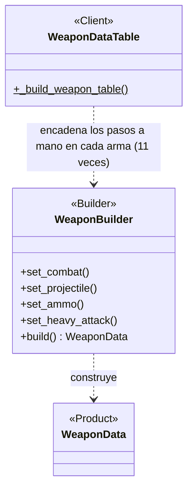
```mermaid
classDiagram
  class WeaponBuilder {
    <<Builder>>
    +set_combat()
    +set_projectile()
    +set_ammo()
    +set_heavy_attack()
    +build() WeaponData
  }
  class WeaponData { <<Product>> }
  class WeaponDataTable {
    <<Client>>
    +_build_weapon_table()$
  }
  WeaponBuilder ..> WeaponData : construye
  WeaponDataTable ..> WeaponBuilder : encadena los pasos a mano en cada arma (11 veces)
```

DESPUÉS
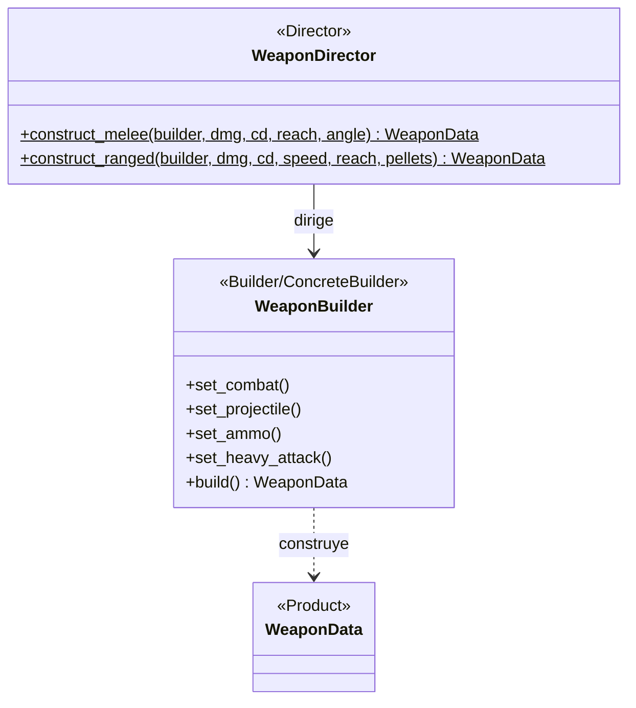
```mermaid
classDiagram
  class WeaponDirector {
    <<Director>>
    +construct_melee(builder, dmg, cd, reach, angle)$ WeaponData
    +construct_ranged(builder, dmg, cd, speed, reach, pellets)$ WeaponData
  }
  class WeaponBuilder {
    <<Builder/ConcreteBuilder>>
    +set_combat()
    +set_projectile()
    +set_ammo()
    +set_heavy_attack()
    +build() WeaponData
  }
  class WeaponData { <<Product>> }
  WeaponDirector --> WeaponBuilder : dirige
  WeaponBuilder ..> WeaponData : construye
```

### Prototype

ANTES
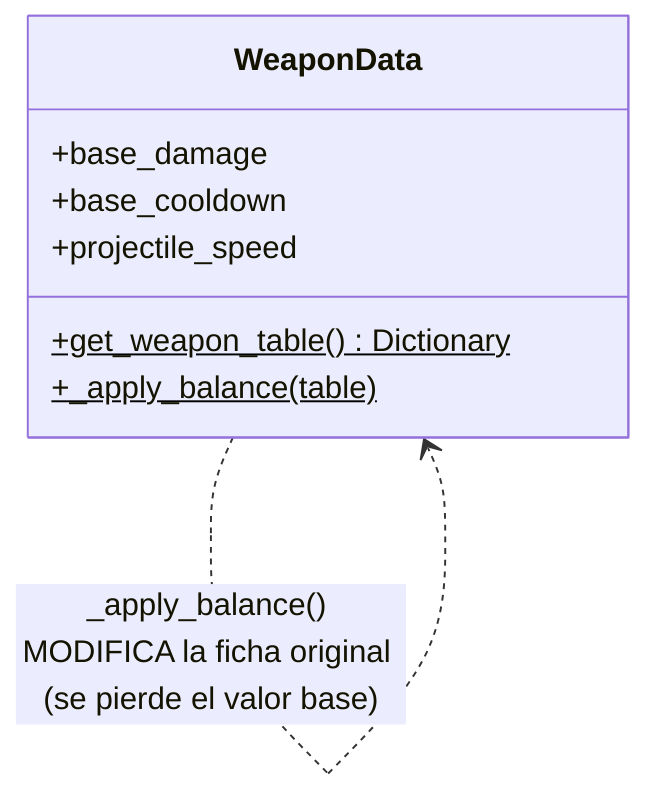
```mermaid
classDiagram
  class WeaponData {
    +base_damage
    +base_cooldown
    +projectile_speed
    +get_weapon_table()$ Dictionary
    +_apply_balance(table)$
  }
  WeaponData ..> WeaponData : _apply_balance() MODIFICA la ficha original (se pierde el valor base)
```

DESPUÉS
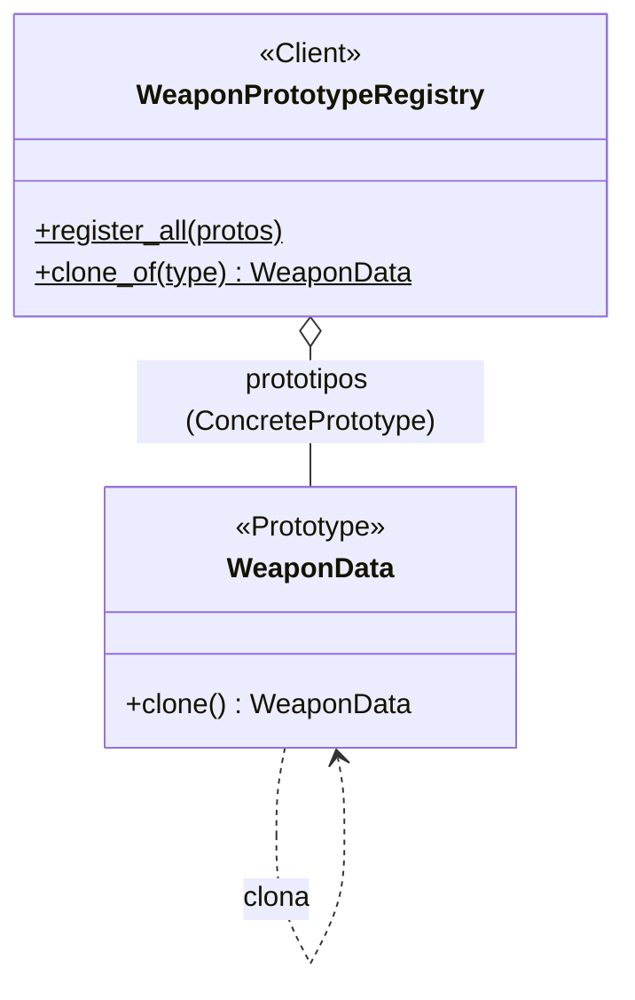
```mermaid
classDiagram
  class WeaponData {
    <<Prototype>>
    +clone() WeaponData
  }
  class WeaponPrototypeRegistry {
    <<Client>>
    +register_all(protos)$
    +clone_of(type)$ WeaponData
  }
  WeaponPrototypeRegistry o-- WeaponData : prototipos (ConcretePrototype)
  WeaponData ..> WeaponData : clona
```

### Singleton
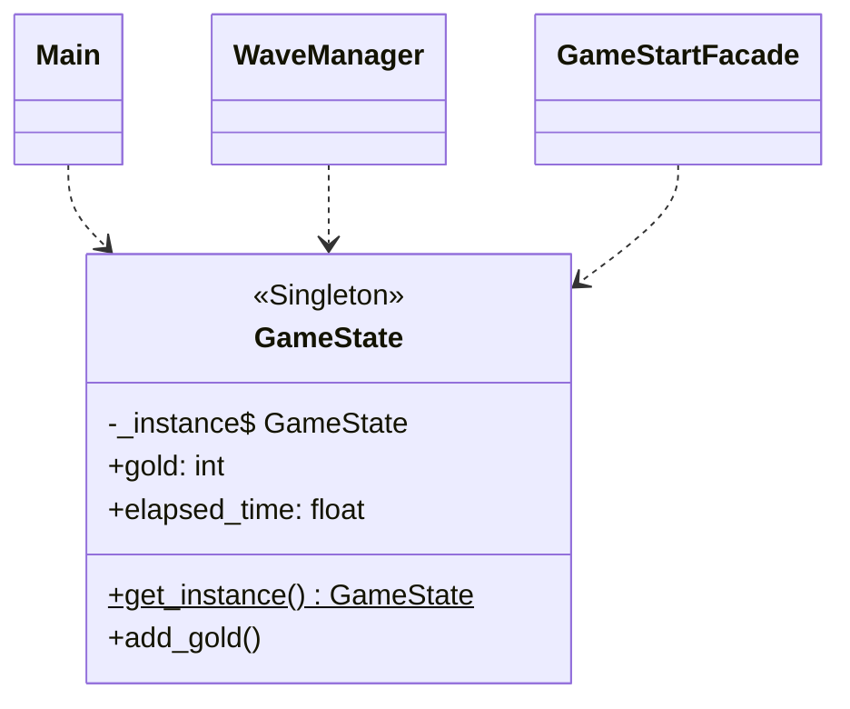
```mermaid
classDiagram
  class GameState {
    <<Singleton>>
    -_instance$ GameState
    +get_instance()$ GameState
    +gold: int
    +elapsed_time: float
    +add_gold()
  }
  Main ..> GameState
  WaveManager ..> GameState
  GameStartFacade ..> GameState
```
ANTES
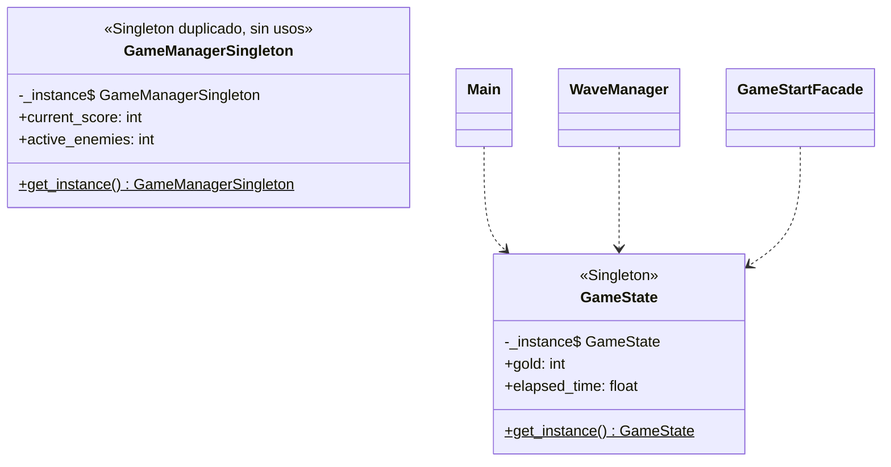
```mermaid
classDiagram
  class GameState {
    <<Singleton>>
    -_instance$ GameState
    +get_instance()$ GameState
    +gold: int
    +elapsed_time: float
  }
  class GameManagerSingleton {
    <<Singleton duplicado, sin usos>>
    -_instance$ GameManagerSingleton
    +get_instance()$ GameManagerSingleton
    +current_score: int
    +active_enemies: int
  }
  Main ..> GameState
  WaveManager ..> GameState
  GameStartFacade ..> GameState
```
DESPUÉS
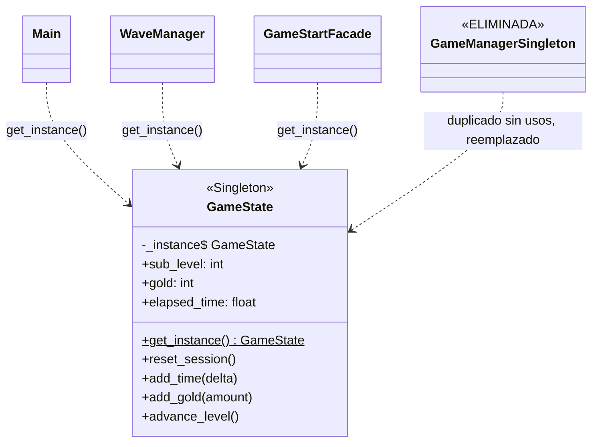
```mermaid
classDiagram
  class GameState {
    <<Singleton>>
    -_instance$ GameState
    +sub_level: int
    +gold: int
    +elapsed_time: float
    +get_instance()$ GameState
    +reset_session()
    +add_time(delta)
    +add_gold(amount)
    +advance_level()
  }
  class GameManagerSingleton {
    <<ELIMINADA>>
  }
  Main ..> GameState : get_instance()
  WaveManager ..> GameState : get_instance()
  GameStartFacade ..> GameState : get_instance()
  GameManagerSingleton ..> GameState : duplicado sin usos, reemplazado
```

## 2. Estructurales

### Decorator

ANTES
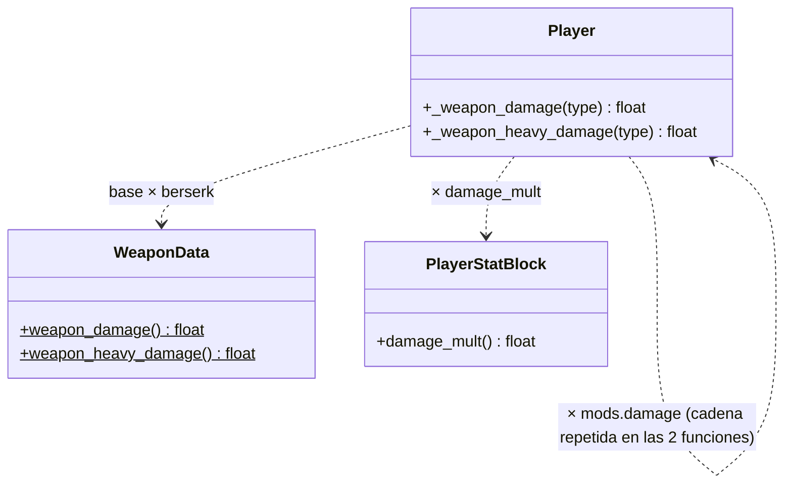
```mermaid
classDiagram
  class Player {
    +_weapon_damage(type) float
    +_weapon_heavy_damage(type) float
  }
  class WeaponData {
    +weapon_damage()$ float
    +weapon_heavy_damage()$ float
  }
  class PlayerStatBlock { +damage_mult() float }
  Player ..> WeaponData : base × berserk
  Player ..> PlayerStatBlock : × damage_mult
  Player ..> Player : × mods.damage (cadena repetida en las 2 funciones)
```

DESPUÉS
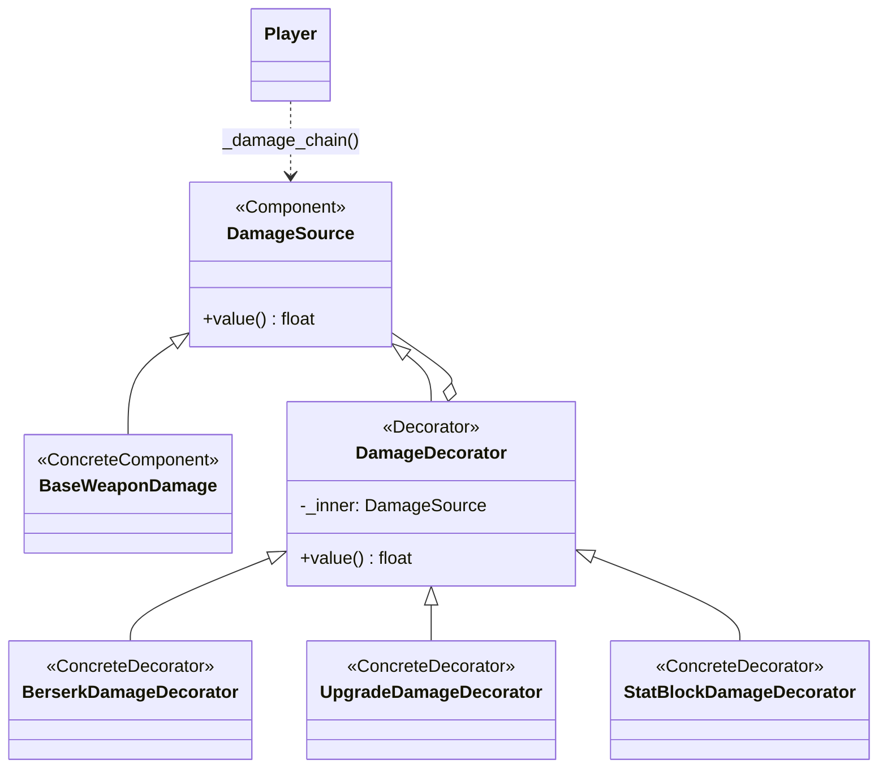
```mermaid
classDiagram
  class DamageSource {
    <<Component>>
    +value() float
  }
  class BaseWeaponDamage { <<ConcreteComponent>> }
  class DamageDecorator {
    <<Decorator>>
    -_inner: DamageSource
    +value() float
  }
  class BerserkDamageDecorator { <<ConcreteDecorator>> }
  class UpgradeDamageDecorator { <<ConcreteDecorator>> }
  class StatBlockDamageDecorator { <<ConcreteDecorator>> }
  DamageSource <|-- BaseWeaponDamage
  DamageSource <|-- DamageDecorator
  DamageDecorator <|-- BerserkDamageDecorator
  DamageDecorator <|-- UpgradeDamageDecorator
  DamageDecorator <|-- StatBlockDamageDecorator
  DamageDecorator o-- DamageSource
  Player ..> DamageSource : _damage_chain()
```

### Flyweight

ANTES
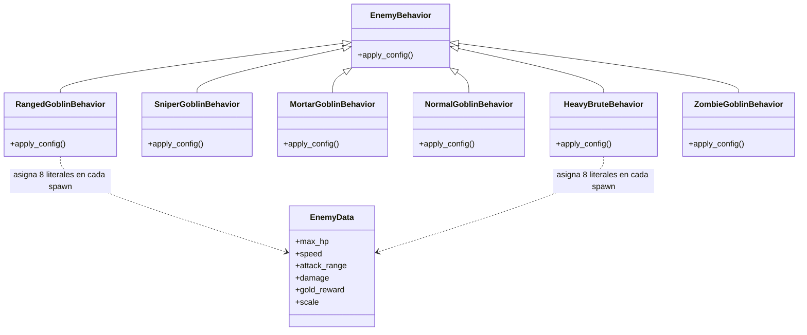
```mermaid
classDiagram
  class EnemyBehavior { +apply_config() }
  class RangedGoblinBehavior { +apply_config() }
  class SniperGoblinBehavior { +apply_config() }
  class MortarGoblinBehavior { +apply_config() }
  class NormalGoblinBehavior { +apply_config() }
  class HeavyBruteBehavior { +apply_config() }
  class ZombieGoblinBehavior { +apply_config() }
  class EnemyData {
    +max_hp
    +speed
    +attack_range
    +damage
    +gold_reward
    +scale
  }
  EnemyBehavior <|-- RangedGoblinBehavior
  EnemyBehavior <|-- SniperGoblinBehavior
  EnemyBehavior <|-- MortarGoblinBehavior
  EnemyBehavior <|-- NormalGoblinBehavior
  EnemyBehavior <|-- HeavyBruteBehavior
  EnemyBehavior <|-- ZombieGoblinBehavior
  RangedGoblinBehavior ..> EnemyData : asigna 8 literales en cada spawn
  HeavyBruteBehavior ..> EnemyData : asigna 8 literales en cada spawn
```

DESPUÉS
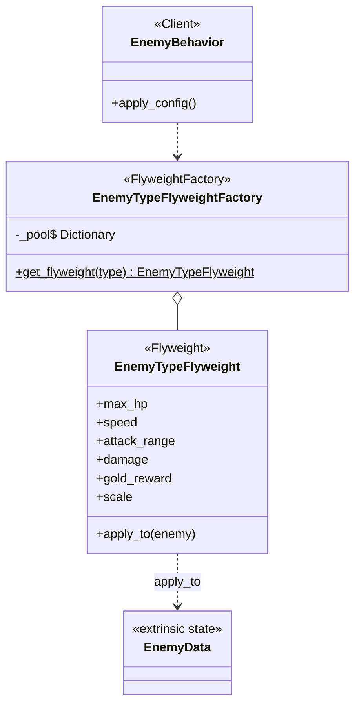
```mermaid
classDiagram
  class EnemyTypeFlyweightFactory {
    <<FlyweightFactory>>
    -_pool$ Dictionary
    +get_flyweight(type)$ EnemyTypeFlyweight
  }
  class EnemyTypeFlyweight {
    <<Flyweight>>
    +max_hp
    +speed
    +attack_range
    +damage
    +gold_reward
    +scale
    +apply_to(enemy)
  }
  class EnemyBehavior {
    <<Client>>
    +apply_config()
  }
  class EnemyData { <<extrinsic state>> }
  EnemyTypeFlyweightFactory o-- EnemyTypeFlyweight
  EnemyBehavior ..> EnemyTypeFlyweightFactory
  EnemyTypeFlyweight ..> EnemyData : apply_to
```

### Adapter

ANTES
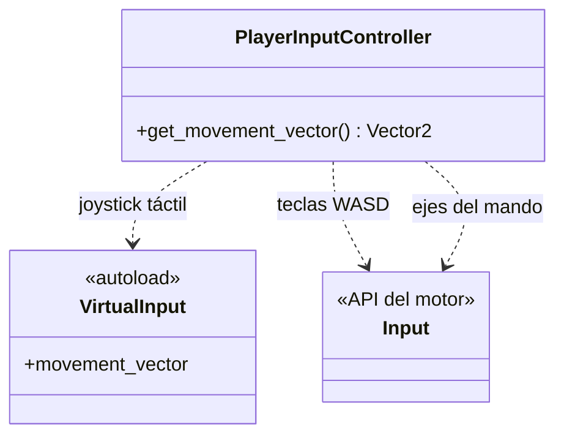
```mermaid
classDiagram
  class PlayerInputController {
    +get_movement_vector() Vector2
  }
  class VirtualInput {
    <<autoload>>
    +movement_vector
  }
  class Input { <<API del motor>> }
  PlayerInputController ..> VirtualInput : joystick táctil
  PlayerInputController ..> Input : teclas WASD
  PlayerInputController ..> Input : ejes del mando
```

DESPUÉS
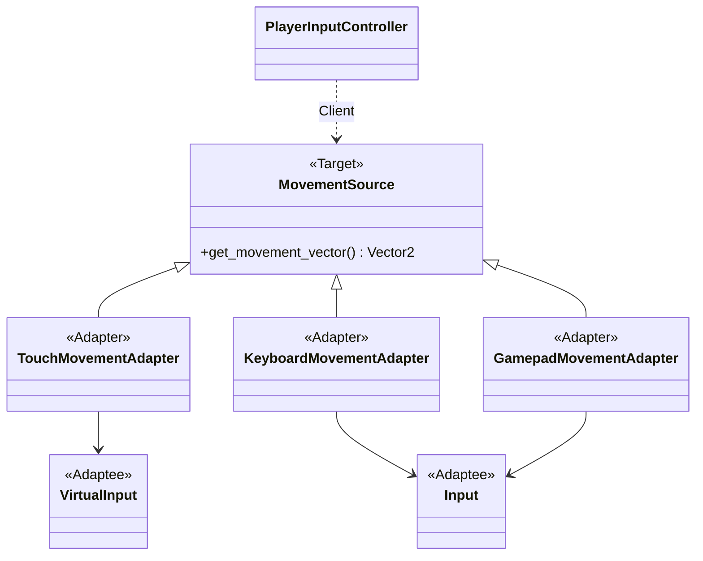
```mermaid
classDiagram
  class MovementSource {
    <<Target>>
    +get_movement_vector() Vector2
  }
  class TouchMovementAdapter { <<Adapter>> }
  class KeyboardMovementAdapter { <<Adapter>> }
  class GamepadMovementAdapter { <<Adapter>> }
  class VirtualInput { <<Adaptee>> }
  class Input { <<Adaptee>> }
  MovementSource <|-- TouchMovementAdapter
  MovementSource <|-- KeyboardMovementAdapter
  MovementSource <|-- GamepadMovementAdapter
  TouchMovementAdapter --> VirtualInput
  KeyboardMovementAdapter --> Input
  GamepadMovementAdapter --> Input
  PlayerInputController ..> MovementSource : Client
```

### Facade (existente)
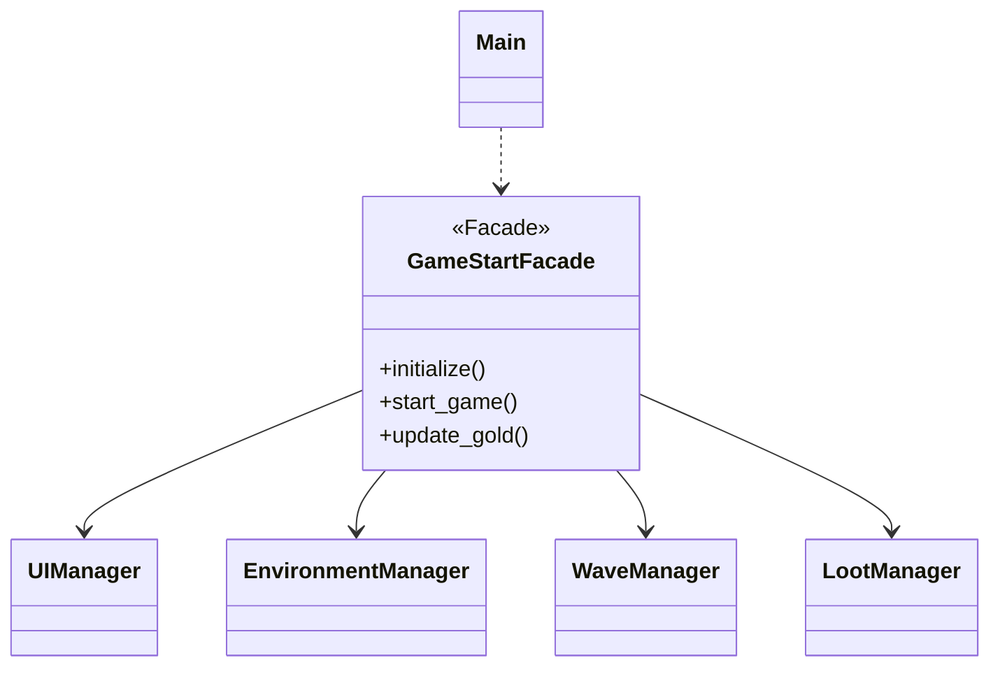
```mermaid
classDiagram
  class GameStartFacade {
    <<Facade>>
    +initialize()
    +start_game()
    +update_gold()
  }
  GameStartFacade --> UIManager
  GameStartFacade --> EnvironmentManager
  GameStartFacade --> WaveManager
  GameStartFacade --> LootManager
  Main ..> GameStartFacade
```

## 3. Diferencias respecto al diagrama de la Entrega 2

| Cambio | Elementos |
|---|---|
| **Eliminados** | `EnemyFactory`, `GameManagerSingleton` |
| **Nuevos (17)** | `EnemyCreator`, `BossCreator`, `NecromancerBossCreator`, `WeaponDirector`, `WeaponPrototypeRegistry`, `DamageSource`, `BaseWeaponDamage`, `DamageDecorator`, `BerserkDamageDecorator`, `UpgradeDamageDecorator`, `StatBlockDamageDecorator`, `EnemyTypeFlyweight`, `EnemyTypeFlyweightFactory`, `MovementSource`, `TouchMovementAdapter`, `KeyboardMovementAdapter`, `GamepadMovementAdapter` |
| **Modificados** | `WeaponData` (+`clone`), `Player` (+`_damage_chain`), `EnemyBehavior` (6 subclases usan el flyweight), `PlayerInputController` (usa adaptadores), `PoolManager`, `Main`, `WaveManager` |
